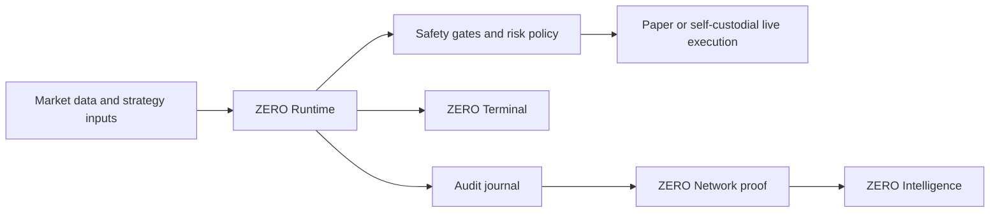

# ZERO

[](https://github.com/zero-intel/zero/actions/workflows/ci.yml)
[](https://github.com/zero-intel/zero/actions/workflows/codeql.yml)
[](https://github.com/zero-intel/zero/actions/workflows/secret-scan.yml)
[](https://github.com/zero-intel/zero/actions/workflows/scorecard.yml)
[](LICENSE)

**Autonomous operating system for self-custodial onchain operations.**

ZERO is an open-source runtime and operator terminal for running autonomous
capital operations without giving up custody. It starts with onchain perpetual
markets: paper-first execution, safety gates, local journals, Hyperliquid
read-only/live boundaries, public proof packets, and intelligence contracts.

> Not another trading bot. ZERO is the control plane that makes autonomous
> onchain operations inspectable, interruptible, and self-custodial.

## Why ZERO Exists

Onchain markets are open 24/7. Leverage punishes attention failure. The old
stack asks operators to stitch together dashboards, alerts, exchange tabs,
copy-trading feeds, scripts, and private spreadsheets, then somehow stay
disciplined under stress.

ZERO turns that workflow into an explicit operating system:

- A runtime that evaluates, rejects, executes, and records decisions.
- A terminal that keeps the operator in control.
- A safety model that makes risk-reducing actions fast and risk-increasing
  actions deliberate.
- A public proof surface for profiles, leaderboards, and verification.
- A commercial intelligence layer built from verified autonomous behavior.

The default mode is paper. Live operation is self-custodial, explicit, and
guarded by preflight checks.

## Product Surfaces

| Surface | Role | Public status |
| --- | --- | --- |
| ZERO Runtime | Python engine for paper/live execution, journals, safety gates, strategy adapters, and venue adapters. | Open source |
| ZERO Terminal | Rust CLI/TUI for setup, diagnostics, state inspection, replay, and supervised actions. | Open source |
| ZERO Network | Public-safe profiles, leaderboards, verification badges, and proof packets. | Open source contracts |
| ZERO Intelligence | Delayed public snapshots plus commercial realtime APIs, history, cohorts, webhooks, exports, and SLAs. | Open contracts + paid access |



## What You Can Run Today

- Run the local paper engine against bundled example candles.
- Run a bounded paper OODA runtime cycle with durable cycle records.
- Add a declarative paper strategy runner with conformance output.
- Start a local paper API and inspect operator state.
- Use the Rust CLI for health checks, status, replay, and supervised actions.
- Query Hyperliquid read-only market data without exposing funds.
- Package release assets with checksums.
- Deploy the paper runtime on Railway or Docker.
- Generate public-safe Network index, profile pages, leaderboard pages, and
  Intelligence contract artifacts.

## See It Run

This is a shortened excerpt from `scripts/demo_capture.sh`, the maintained
local paper-mode demo:

```text
$ zero --api http://127.0.0.1:8765 doctor
[   ok] engine_reachable       zero-paper-engine v0.1.1
[ warn] auth                   no token set — read-only endpoints only
[ warn] live_preflight         not ready: live_executor, wallet, key, journal

$ zero --api http://127.0.0.1:8765 run status
engine: regime=PAPER MARKET. Local deterministic demo.
equity=$10000.00  open=0  recovery=ephemeral

$ zero --api http://127.0.0.1:8765 run risk
risk: OK  equity=$10000.00  peak=$10000.00  dd=0.00%  open=0

$ curl -fsS -H 'content-type: application/json' -d '{...}' /execute
{"accepted": true, "coin": "BTC", "side": "buy", "simulated": true}

$ curl -fsS http://127.0.0.1:8765/network/profile
{"schema_version": "zero.network.profile.v1", "mode": "paper", "verification": {"status": "verified"}}

$ curl -fsS http://127.0.0.1:8765/intelligence/snapshot
{"schema_version": "zero.intelligence.snapshot.v1", "access": {"class": "public_delayed", "delay_s": 900}}

$ curl -fsS http://127.0.0.1:8765/live/preflight
{"schema_version": "zero.live_preflight.v1", "live_mode": "refused", "ready": false}

$ zero --api http://127.0.0.1:8765 run live-cockpit
live-cockpit: live_mode=refused  ready=false  risk_allowed=false

$ curl -fsS http://127.0.0.1:8765/operator/context
{"schema_version": "zero.operator_context.v1", "handle": "local-operator", "scope": "local-private"}

$ curl -fsS http://127.0.0.1:8765/hl/reconcile
{"schema_version": "zero.reconciliation.v1", "status": "not_configured", "risk_increasing_allowed": false}

$ curl -fsS http://127.0.0.1:8765/live/certification
{"schema_version": "zero.live_certification.v1", "mode": "dry_run", "passed": true}

$ curl -fsS http://127.0.0.1:8765/immune
{"schema_version": "zero.immune.v1", "risk_increasing_allowed": false}
```

## Install CLI

Install the latest release binary:

```bash
curl -fsSL https://raw.githubusercontent.com/zero-intel/zero/main/scripts/install.sh | bash
zero --version
```

The installer downloads the GitHub Release asset for your OS, verifies
`SHA256SUMS`, verifies the GitHub artifact attestation, and installs `zero` to
`~/.local/bin` by default.

## Source Quickstart

Requirements: Python 3.11+, Rust stable, Cargo, and `just`.

```bash
git clone https://github.com/zero-intel/zero.git
cd zero
just bootstrap
just demo
just paper-api-smoke
```

Run the paper API:

```bash
just paper-api
```

Run the CLI:

```bash
cd cli
cargo run -q -p zero -- --api http://127.0.0.1:8765 doctor
cargo run -q -p zero -- --api http://127.0.0.1:8765 run status
cargo run -q -p zero -- --api http://127.0.0.1:8765 run risk
```

Run the full local gate:

```bash
just ci
```

Run one paper runtime cycle:

```bash
PYTHONPATH="$PWD/engine/src" zero-engine-run \
  --journal .zero/decisions.jsonl \
  --runtime-bus .zero/runtime-bus \
  --once \
  --interval 0
```

For the complete first-run path, see
[docs/first-10-minutes.md](docs/first-10-minutes.md). For a reproducible
terminal demo capture, run:

```bash
scripts/demo_capture.sh
```

Use an installed release binary for the same capture:

```bash
ZERO_BIN="$(command -v zero)" scripts/demo_capture.sh
```

## Safety Model

ZERO is built around operational discipline, not activity.

- Paper mode is the default.
- Public examples must run without real funds.
- Live execution requires explicit environment configuration and preflight
  checks.
- Risk-reducing actions should remain low-friction.
- Risk-increasing actions should require deliberate operator confirmation.
- Journals and proof packets must be redacted before publication.
- Hosted custody is not part of the product.

Read the full model in [docs/safety-model.md](docs/safety-model.md),
[docs/threat-model.md](docs/threat-model.md), and
[docs/incident-runbooks.md](docs/incident-runbooks.md).

## Open Core Boundary

ZERO is open infrastructure plus commercial intelligence.

| Open | Commercial |
| --- | --- |
| Runtime engine, safety gates, paper mode, local API, CLI, Docker/Railway deployment, public profile contracts, leaderboards, delayed snapshots, docs, tests, and release tooling. | Realtime Intelligence API, deeper history, cohorts, benchmarks, commercial connectors, higher rate limits, webhooks, bulk exports, redistribution rights, support, reliability commitments, and SLAs. |

The open repository must stay useful without a ZERO-hosted control plane. The
commercial product sells speed, scale, history, reliability, and intelligence
access, not custody or basic runtime operation.

See [docs/open-core-boundary.md](docs/open-core-boundary.md) and
[docs/zero-intelligence.md](docs/zero-intelligence.md).

## Repository Map

```text
engine/        Python ZERO Runtime and paper API
cli/           Rust operator terminal
contracts/     Public API, Network, and Intelligence contract examples
examples/      Paper-trading examples and sample candles
docs/          Architecture, safety, deployment, release, and product docs
scripts/       Smoke tests, release packaging, Railway entrypoints, hardening gates
.github/       CI, CodeQL, secret scanning, Scorecard, issue and PR templates
```

## Deployment

ZERO is local-first, Railway-first, and Docker-compatible. Operators own their
deployment project, secrets, exchange credentials, and runtime state.

- [docs/local-development.md](docs/local-development.md)
- [docs/railway-deploy.md](docs/railway-deploy.md)
- [docs/distribution.md](docs/distribution.md)
- [docs/release.md](docs/release.md)

## Contributor Paths

Good first contribution areas:

- Declarative strategy runners that stay paper-first.
- Strategy examples that stay paper-first.
- Strategy plugins that return signals but leave execution and risk checks to
  ZERO.
- Market data adapters with deterministic tests.
- ZERO Network index, profile, and leaderboard pages over redacted public
  contracts.
- CLI diagnostics and replay views.
- Safety gate tests.
- Documentation and runbook improvements.
- Public Network and Intelligence contract examples.

Before opening a pull request:

```bash
just ci
```

Read [CONTRIBUTING.md](CONTRIBUTING.md), [SECURITY.md](SECURITY.md), and
[GOVERNANCE.md](GOVERNANCE.md).

Using a coding or design agent? Start with [AGENTS.md](AGENTS.md) and
[docs/agentic-contribution.md](docs/agentic-contribution.md). Agent-authored
changes should stay scoped, paper-first by default, and explicit about safety
invariants.

## Documentation

- [Architecture](docs/architecture.md)
- [Positioning](docs/positioning.md)
- [First 10 Minutes](docs/first-10-minutes.md)
- [Demo Terminal](docs/demo-terminal.md)
- [CLI Quickstart](docs/cli-quickstart.md)
- [API](docs/api.md)
- [OpenAPI Contract](openapi/zero-paper-api.v1.yaml)
- [API Compatibility](docs/api-compatibility.md)
- [Operator Context](docs/operator-context.md)
- [Deployment Identity](docs/deployment-identity.md)
- [Operator Isolation](docs/operator-isolation.md)
- [Strategy Plugins](docs/strategy-plugins.md)
- [Market Data Adapters](docs/market-data-adapters.md)
- [Hyperliquid Read-only](docs/hyperliquid-readonly.md)
- [ZERO Network](docs/zero-network.md)
- [ZERO Intelligence](docs/zero-intelligence.md)
- [Production Readiness](docs/production-readiness.md)
- [Autonomous OS Plan](docs/autonomous-os-plan.md)
- [Agentic Contribution](docs/agentic-contribution.md)
- [Launch Scorecard](docs/launch-scorecard.md)
- [Roadmap](docs/roadmap.md)

## License

Apache-2.0. See [LICENSE](LICENSE).
