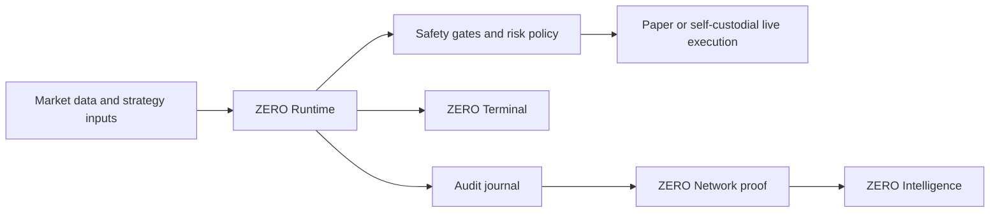

# ZERO

[](https://github.com/zero-intel/zero/actions/workflows/ci.yml)
[](https://github.com/zero-intel/zero/actions/workflows/codeql.yml)
[](https://github.com/zero-intel/zero/actions/workflows/secret-scan.yml)
[](https://github.com/zero-intel/zero/actions/workflows/scorecard.yml)
[](LICENSE)

**Autonomous operating system for self-custodial onchain operations.**

ZERO is an open-source runtime and operator terminal for running autonomous
capital operations without giving up custody. It starts with onchain perpetual
markets: paper-first execution, safety gates, local journals, Hyperliquid
read-only/live boundaries, public proof packets, and intelligence contracts.

> Not another trading bot. ZERO is the control plane that makes autonomous
> onchain operations inspectable, interruptible, and self-custodial.

ZERO has three non-negotiable product rules:

- The engine is open source and useful without a hosted ZERO control plane.
- Operators keep custody; live-capital paths are local, explicit, and gated.
- Public reputation is built from redacted proof, not screenshots or claims.

## Current Launch Status

This repository is the public product page and open-core engineering home for
ZERO. It is useful today for paper-mode runtime work, operator-terminal
development, safety-gate design, public proof contracts, and ZERO Intelligence
API contract work.

It is not yet a promise that a new operator can clone the repo and run a fully
autonomous live-capital system unattended. Live-capable code must pass local
custody, reconciliation, immune, journal, dead-man, and operator-friction
checks before risk can increase. Treat live mode as a self-custodial canary
path, not a shortcut.

## Why ZERO Exists

Onchain markets are open 24/7. Leverage punishes attention failure. The old
stack asks operators to stitch together dashboards, alerts, exchange tabs,
copy-trading feeds, scripts, and private spreadsheets, then somehow stay
disciplined under stress.

ZERO turns that workflow into an explicit operating system:

- A runtime that evaluates, rejects, executes, and records decisions.
- A terminal that keeps the operator in control.
- A safety model that makes risk-reducing actions fast and risk-increasing
  actions deliberate.
- A public proof surface for profiles, leaderboards, and verification.
- A commercial intelligence layer built from verified autonomous behavior.

The default mode is paper. Live operation is self-custodial, explicit, and
guarded by preflight checks.

## Product Surfaces

| Surface | Role | Public status |
| --- | --- | --- |
| ZERO Runtime | Python engine for paper execution, live-readiness contracts, journals, safety gates, strategy adapters, venue adapter interfaces, and canary evidence. | Open source |
| ZERO Terminal | Rust CLI/TUI for setup, diagnostics, state inspection, replay, live cockpit views, and supervised actions. | Open source |
| ZERO Evolution | Local memory, genesis proposals, research reports, decision-stack review, guardian review, red-team, paper canaries, calibration, and evolve loops that let ZERO improve under review. | Memory, genesis, research, decision stack, and paper-only evolve gates open; remaining promotion loop in progress |
| ZERO Network | Public-safe profiles, leaderboards, verification badges, and proof packets. | Open source contracts |
| ZERO Intelligence | Delayed public snapshots plus commercial realtime APIs, history, cohorts, webhooks, exports, and SLAs. | Open contracts + paid access |

## Capability Boundary

| Capability | Public repo state |
| --- | --- |
| Paper engine | Runnable now with deterministic fixtures, local API, CLI, Docker, and Railway paths. |
| Live market data | Runnable now through read-only Hyperliquid public info calls when enabled. |
| Live readiness | Runnable now as local preflight, cockpit, certification, reconciliation, immune, receipt, and evidence contracts. |
| Live execution | Code boundary exists, but live capital remains operator-owned and gated until local custody, preflight, journal, kill-switch, reconciliation, and canary evidence pass. |
| Self-evolution | Local memory, genesis proposal core, research command chain, decision-stack lenses/layers/modifiers, and paper-only evolve gates exist now with redacted extraction, append-only journals, guardian classification, hunt/edge/convergence/thesis/score/meta/sharpen reports, public evaluation surfaces, red-team review, paper canary, calibration, API readouts, and MCP snapshots. Real mutation, promotion, and rollback remain planned public extraction. |
| Public proof | Runnable now through redacted Network contracts, canary bundles, exchange-evidence normalization, recursive checksums, and operator report verification. |
| Commercial API | Contracted now as ZERO Intelligence; production hosted persistence, billing, warehouse history, and SLAs are commercial work. |



## What You Can Run Today

- Run the local paper engine against bundled example candles.
- Run a bounded paper OODA runtime cycle with durable cycle records.
- Extract local public-safe memory from paper decisions and generate
  `knowledge.md`.
- Classify fixture-backed genesis proposals as accepted, rejected, or escalated
  without applying code changes.
- Run the paper-only evolve harness for accepted genesis proposals without
  mutating the checkout or pushing a branch.
- Run the paper-only research command chain for hunt, edge, convergence,
  thesis, score, meta, and sharpen reports from public fixtures.
- Inspect the public decision stack for lenses, layers, modifiers, and
  paper/live separation.
- Add a declarative paper strategy runner with conformance output.
- Start a local paper API and inspect operator state.
- Use the Rust CLI for health checks, status, replay, and supervised actions.
- Query Hyperliquid read-only market data without exposing funds.
- Exercise live-readiness, immune, reconciliation, and certification contracts
  without placing capital at risk.
- Capture signed, public-safe live evidence packets for supervised canary
  rehearsal without leaking credentials or raw private journals.
- Run the maintained live canary rehearsal collector in fail-closed public
  paper mode, or in explicit operator-owned canary mode when local live gates
  are ready.
- Verify canary evidence bundles locally before sharing them as launch or
  incident evidence.
- Attach public-safe exchange-side order/fill evidence to canary bundles and
  verify it against ZERO live receipts without exposing raw venue payloads.
- Run and verify a one-command live canary operator workflow that collects,
  attaches, verifies, checksums, and reports public-safe evidence.
- Capture a read-only live cockpit drill bundle for preflight, immune,
  reconciliation, certification, receipt, evidence, metrics, and audit packets.
- Package release assets with checksums.
- Deploy the paper runtime on Railway or Docker.
- Generate public-safe Network index, profile pages, leaderboard pages, and
  Intelligence contract artifacts.

The self-evolving loop that makes ZERO a complete autonomous operating system
is now partially implemented: local memory, genesis proposal classification,
paper-only research, public decision-stack review, and paper-only evolve gates
exist, while real mutation, promotion, and rollback remain first-class public
extraction targets. See
[Memory Core](docs/memory-core.md), [Genesis](docs/genesis.md),
[Research Command Chain](docs/research.md), [Decision Stack](docs/decision-stack.md),
[Evolve Harness](docs/evolve.md), and
[Private Engine Capability Gap Audit](docs/private-engine-capability-gap-audit.md).

## Operator Proof Path

ZERO should earn trust through behavior that another engineer can verify:

1. Run paper mode locally or on Railway.
2. Inspect runtime, risk, live cockpit, immune, account, and reconciliation
   packets through the CLI/API.
3. Rehearse a live canary in fail-closed mode.
4. Attach public-safe exchange-side evidence when an operator-owned live canary
   is ready.
5. Verify the bundle, recursive checksums, privacy flags, and report with local
   scripts before publishing anything.

That flow is implemented for refusal-mode rehearsal today. Accepted live canary
evidence requires an operator-owned Hyperliquid wallet and explicit local live
configuration; it is not part of public CI.

## See It Run

This is a shortened excerpt from `scripts/demo_capture.sh`, the maintained
local paper-mode demo:

```text
$ zero --api http://127.0.0.1:8765 doctor
[   ok] engine_reachable       zero-paper-engine v0.1.1
[ warn] auth                   no token set — read-only endpoints only
[ warn] live_preflight         not ready: live_executor, wallet, key, journal

$ zero --api http://127.0.0.1:8765 run status
engine: regime=PAPER MARKET. Local deterministic demo.
equity=$10000.00  open=0  recovery=ephemeral

$ zero --api http://127.0.0.1:8765 run risk
risk: OK  equity=$10000.00  peak=$10000.00  dd=0.00%  open=0

$ curl -fsS -H 'content-type: application/json' -d '{...}' /execute
{"accepted": true, "coin": "BTC", "side": "buy", "simulated": true}

$ curl -fsS http://127.0.0.1:8765/network/profile
{"schema_version": "zero.network.profile.v1", "mode": "paper", "verification": {"status": "verified"}}

$ curl -fsS http://127.0.0.1:8765/deployment/heartbeat
{"schema_version": "zero.deployment.heartbeat.v1", "liveness": {"status": "paper_only"}}

$ curl -fsS http://127.0.0.1:8765/intelligence/snapshot
{"schema_version": "zero.intelligence.snapshot.v1", "access": {"class": "public_delayed", "delay_s": 900}}

$ curl -fsS http://127.0.0.1:8765/live/preflight
{"schema_version": "zero.live_preflight.v1", "live_mode": "refused", "ready": false}

$ zero --api http://127.0.0.1:8765 run live-cockpit
live-cockpit: live_mode=refused  ready=false  risk_allowed=false

$ curl -fsS http://127.0.0.1:8765/operator/context
{"schema_version": "zero.operator_context.v1", "handle": "local-operator", "scope": "local-private"}

$ curl -fsS http://127.0.0.1:8765/memory
{"schema_version": "zero.memory.snapshot.v1", "stats": {"active_entries": 0}}

$ curl -fsS http://127.0.0.1:8765/genesis
{"schema_version": "zero.genesis.snapshot.v1", "mode": "plan-only"}

$ curl -fsS http://127.0.0.1:8765/evolve
{"schema_version": "zero.evolve.snapshot.v1", "mode": "paper-only"}

$ curl -fsS http://127.0.0.1:8765/research
{"schema_version": "zero.research.snapshot.v1", "mode": "paper-only"}

$ curl -fsS http://127.0.0.1:8765/hl/reconcile
{"schema_version": "zero.reconciliation.v1", "status": "not_configured", "risk_increasing_allowed": false}

$ curl -fsS http://127.0.0.1:8765/live/certification
{"schema_version": "zero.live_certification.v1", "mode": "dry_run", "passed": true}

$ curl -fsS http://127.0.0.1:8765/live/evidence
{"schema_version": "zero.live_evidence.v1", "live_mode": "refused", "evidence_hash": "sha256:..."}

$ scripts/live_canary_rehearsal.py http://127.0.0.1:8765 --mode refusal
zero live canary rehearsal: wrote artifacts/live-canary-rehearsal/... mode=refusal risk_ready=False attempted=True accepted=False

$ scripts/live_canary_exchange_evidence.py artifacts/live-canary-rehearsal/... hyperliquid-export.json
zero live canary exchange evidence: wrote artifacts/live-canary-rehearsal/.../exchange_evidence.json matched=0 accepted=0

$ scripts/live_canary_verify.py artifacts/live-canary-rehearsal/... --require-mode refusal --require-exchange-evidence
zero live canary verify: ok=True checks=... fail=0

$ scripts/live_canary_operator.py http://127.0.0.1:8765 --mode refusal
zero live canary operator: ok=True bundle=artifacts/live-canary-operator/.../bundle exchange=True report=artifacts/live-canary-operator/.../operator_report.json

$ scripts/live_canary_operator_verify.py artifacts/live-canary-operator/...
zero live canary operator verify: ok=True checks=... fail=0

$ scripts/live_cockpit_drill.py http://127.0.0.1:8765
zero live cockpit drill: ok=True ready=False risk_allowed=False fail=0 output=artifacts/live-cockpit-drill/...

$ scripts/live_cockpit_drill_verify.py artifacts/live-cockpit-drill/...
zero live cockpit drill verify: ok=True checks=... fail=0

$ scripts/live_cockpit_drill_tamper_rehearsal.py artifacts/live-cockpit-drill/...
zero live cockpit drill tamper rehearsal: ok=True checks=3 fail=0

$ curl -fsS http://127.0.0.1:8765/immune
{"schema_version": "zero.immune.v1", "risk_increasing_allowed": false}
```

## Install CLI

Install the latest release binary:

```bash
curl -fsSL https://raw.githubusercontent.com/zero-intel/zero/main/scripts/install.sh | bash
zero --version
```

The installer downloads the GitHub Release asset for your OS, verifies
`SHA256SUMS`, verifies the GitHub artifact attestation, and installs `zero` to
`~/.local/bin` by default.

## Source Quickstart

Requirements: Python 3.11+, Rust stable, Cargo, and `just`.

```bash
git clone https://github.com/zero-intel/zero.git
cd zero
just bootstrap
just demo
just paper-api-smoke
```

Run the paper API:

```bash
just paper-api
```

Run the CLI:

```bash
cd cli
cargo run -q -p zero -- --api http://127.0.0.1:8765 doctor
cargo run -q -p zero -- --api http://127.0.0.1:8765 run status
cargo run -q -p zero -- --api http://127.0.0.1:8765 run risk
```

Run the full local gate:

```bash
just ci
```

Run one paper runtime cycle:

```bash
PYTHONPATH="$PWD/engine/src" zero-engine-run \
  --journal .zero/decisions.jsonl \
  --runtime-bus .zero/runtime-bus \
  --once \
  --interval 0
```

For the complete first-run path, see
[docs/first-10-minutes.md](docs/first-10-minutes.md). For a reproducible
terminal demo capture, run:

```bash
scripts/demo_capture.sh
```

Maintainers can also prove the publishable source tree works outside this
checkout by copying it into a temporary directory, rerunning hardening, and
smoking the paper API through the CLI:

```bash
just fresh-clone-rehearsal
```

Use an installed release binary for the same capture:

```bash
ZERO_BIN="$(command -v zero)" scripts/demo_capture.sh
```

## Safety Model

ZERO is built around operational discipline, not activity.

- Paper mode is the default.
- Public examples must run without real funds.
- Live execution requires explicit environment configuration and preflight
  checks.
- Risk-reducing actions should remain low-friction.
- Risk-increasing actions should require deliberate operator confirmation.
- Journals and proof packets must be redacted before publication.
- Hosted custody is not part of the product.

Read the full model in [docs/safety-model.md](docs/safety-model.md),
[docs/threat-model.md](docs/threat-model.md), and
[docs/incident-runbooks.md](docs/incident-runbooks.md).

## Open Core Boundary

ZERO is open infrastructure plus commercial intelligence.

| Open | Commercial |
| --- | --- |
| Runtime engine, safety gates, paper mode, local API, CLI, Docker/Railway deployment, public profile contracts, leaderboards, delayed snapshots, docs, tests, and release tooling. | Realtime Intelligence API, deeper history, cohorts, benchmarks, commercial connectors, higher rate limits, webhooks, bulk exports, redistribution rights, support, reliability commitments, and SLAs. |

The open repository must stay useful without a ZERO-hosted control plane. The
commercial product sells speed, scale, history, reliability, and intelligence
access, not custody or basic runtime operation.

See [docs/open-core-boundary.md](docs/open-core-boundary.md) and
[docs/zero-intelligence.md](docs/zero-intelligence.md).

## Repository Map

```text
engine/        Python ZERO Runtime and paper API
cli/           Rust operator terminal
contracts/     Public API, Network, and Intelligence contract examples
examples/      Paper-trading examples and sample candles
docs/          Architecture, safety, deployment, release, and product docs
scripts/       Smoke tests, release packaging, Railway entrypoints, hardening gates
.github/       CI, CodeQL, secret scanning, Scorecard, issue and PR templates
```

## Deployment

ZERO is local-first, Railway-first, and Docker-compatible. Operators own their
deployment project, secrets, exchange credentials, and runtime state.

- [docs/local-development.md](docs/local-development.md)
- [docs/railway-deploy.md](docs/railway-deploy.md)
- [docs/distribution.md](docs/distribution.md)
- [docs/release.md](docs/release.md)

## Contributor Paths

Good first contribution areas:

- Declarative strategy runners that stay paper-first.
- Strategy examples that stay paper-first.
- Strategy plugins that return signals but leave execution and risk checks to
  ZERO.
- Market data adapters with deterministic tests.
- ZERO Network index, profile, and leaderboard pages over redacted public
  contracts.
- CLI diagnostics and replay views.
- Safety gate tests.
- Documentation and runbook improvements.
- Public Network and Intelligence contract examples.

Before opening a pull request:

```bash
just ci
```

Read [CONTRIBUTING.md](CONTRIBUTING.md), [SECURITY.md](SECURITY.md), and
[GOVERNANCE.md](GOVERNANCE.md).

Using a coding or design agent? Start with [AGENTS.md](AGENTS.md) and
[docs/agentic-contribution.md](docs/agentic-contribution.md). Agent-authored
changes should stay scoped, paper-first by default, and explicit about safety
invariants.

For a 30-second agent smoke:

```bash
PYTHONPATH="$PWD/engine/src" python3 -m zero_engine.mcp --smoke
PYTHONPATH="$PWD/engine/src" scripts/mcp_transcript.py --check
```

Machine-readable entrypoints:

- [llms.txt](llms.txt)
- [docs/llms.txt](docs/llms.txt)
- [docs/llms-full.txt](docs/llms-full.txt)
- [AGENTS.md](AGENTS.md)
- [Agent Commands](.claude/commands/README.md)
- [Issue Templates](.github/ISSUE_TEMPLATE/agent_task.yml)
- [OpenAPI Contract](openapi/zero-paper-api.v1.yaml)
- [Memory Core](docs/memory-core.md)
- [Genesis](docs/genesis.md)
- [Research Command Chain](docs/research.md)
- [Decision Stack](docs/decision-stack.md)
- [Evolve Harness](docs/evolve.md)
- [MCP Server](docs/mcp.md)
- [MCP Transcript](docs/mcp/transcript.jsonl)

## Documentation

- [Architecture](docs/architecture.md)
- [Positioning](docs/positioning.md)
- [First 10 Minutes](docs/first-10-minutes.md)
- [Demo Terminal](docs/demo-terminal.md)
- [Proof Packs](docs/proof/README.md)
- [CLI Quickstart](docs/cli-quickstart.md)
- [API](docs/api.md)
- [Memory Core](docs/memory-core.md)
- [Research Command Chain](docs/research.md)
- [Decision Stack](docs/decision-stack.md)
- [MCP Server](docs/mcp.md)
- [OpenAPI Contract](openapi/zero-paper-api.v1.yaml)
- [API Compatibility](docs/api-compatibility.md)
- [Operator Context](docs/operator-context.md)
- [Deployment Identity](docs/deployment-identity.md)
- [Live Evidence](docs/live-evidence.md)
- [Live Canary Operator](docs/live-canary-operator.md)
- [Operator Isolation](docs/operator-isolation.md)
- [Strategy Plugins](docs/strategy-plugins.md)
- [Market Data Adapters](docs/market-data-adapters.md)
- [Hyperliquid Read-only](docs/hyperliquid-readonly.md)
- [ZERO Network](docs/zero-network.md)
- [ZERO Intelligence](docs/zero-intelligence.md)
- [Model Gateway](docs/model-gateway.md)
- [Production Readiness](docs/production-readiness.md)
- [Public Upgrade Plan](docs/public-upgrade.md)
- [Autonomous OS Plan](docs/autonomous-os-plan.md)
- [Capability Gap Audit](docs/private-engine-capability-gap-audit.md)
- [Agentic Contribution](docs/agentic-contribution.md)
- [Launch Scorecard](docs/launch-scorecard.md)
- [Roadmap](docs/roadmap.md)

## License

Apache-2.0. See [LICENSE](LICENSE).
